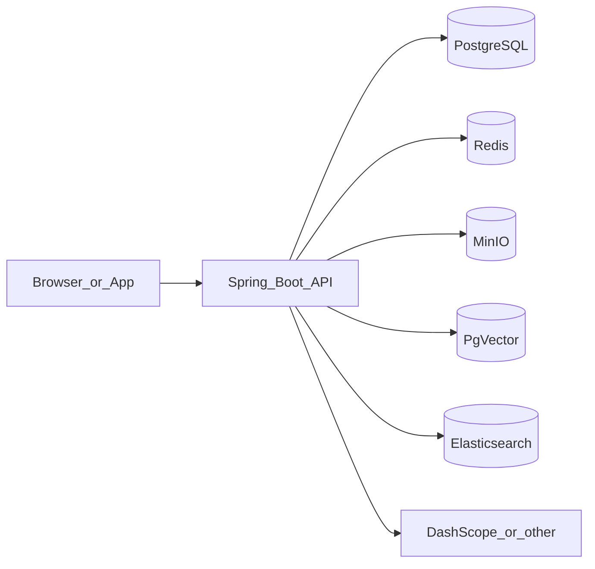

# 01 项目总览与边界

## 1.1 项目定位

**Dong RAG** 是一个面向企业场景的**知识库 + 检索增强生成（RAG）+ 多专家知识助手**后端系统，强调：

- 组（Group）级数据隔离与权限
- 文档**异步入库**与可重试任务
- **向量 + 全文**混合检索与证据门控
- 知识助手**固定多专家编排**（Planner → 并行 Worker → 汇总），NDJSON 流式输出
- 可选的会话持久化、意图路由、投诉槽位引导、滚动摘要与检索检测等治理能力

## 1.2 能力边界（明确「有什么 / 没有什么」）

| 能力 | 说明 |
|------|------|
| 多租户隔离 | 以 `groupId` 为核心：文档、向量、ES、检索与助手上下文均限定在当前组 |
| 入库 | 文本/文件上传 → MinIO → 解析（Tika）→ 切分 → PgVector + ES，异步任务与状态机 |
| 简单问答 | `POST /rag/qa/ask`：单次混合检索 + LLM，适合用户端「知识问答」页 |
| 知识助手 | `POST /assistant/chat`：**仅**多专家路径，无「单路检索模式」；可投诉模板 |
| 实时业务系统 | **不包含**内建订单/ERP；若需「查我的单」需自行扩展 Tool 与鉴权 |
| 网关限流 | 单体应用内熔断/指标为主；**不包含**独立 API Gateway 实现 |

## 1.3 与前端工程的关系

| 工程 | 路径 | 角色 |
|------|------|------|
| 后端 API | `src/main/java/com/dong/dongrag` | 统一 `/api` 前缀（由网关或 devServer 代理） |
| 用户端 | `frontend/` | 组、入库、问答、知识助手（流式 NDJSON） |
| 管理端 | `admin-frontend/` | 用户管理、入库任务、检索检测、编排评测、系统信息等 |

详见 [13-frontend-user-app.md](13-frontend-user-app.md)、[14-admin-frontend.md](14-admin-frontend.md)。

## 1.4 请求全链路（概念）

## 实现思路与技术要点

- **为何以「组」为边界**：企业知识库场景下，权限与计费常以部门/项目空间划分；用 `groupId` 贯穿 DB、向量 metadata、ES 与助手上下文，比「每用户一库」更易共享协作，比粗粒度多租户更易在单库内运维。
- **为何异步入库**：解析与 embedding 耗时长、失败可重试；HTTP 快速返回任务 id，由后台线程 + 调度兜底，避免网关超时并便于管理端观测。
- **为何双索引（向量 + ES）**：向量擅长语义近邻，ES 擅长关键词与结构化过滤；RRF 融合降低单路失效风险，与业界混合检索实践一致。
- **为何助手固定多专家编排**：在可控延迟内约束「Planner → 并行 Worker → 汇总」形态，比完全自主 Agent 更易审计工具调用（如 `KB_SEARCH`）与输出策略（Policy）。
- **前后端拆分**：后端专注协议与数据；用户端与管理端独立部署与鉴权存储，减少单仓前端体积与发布耦合。

下一篇：[02-tech-stack-and-structure.md](02-tech-stack-and-structure.md)  
[返回文档中心](README.md)
